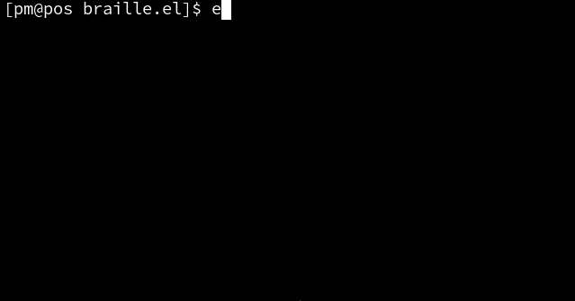

# braille.el ⣿
Emacs minor mode for drawing with braille characters
using a mouse or drawing tablet.



braille.el can draw on any character, but by default, for convenience, it will avoid drawing on any character that is not a braille character or space. This can be customised with `braille-consider-text-out-of-bounds`.

braille.el uses by default normal space characters for its canvas. It has the option to use the braille empty grid character instead. This can be useful if you intend to use your artwork in an environment that is not going to display it a monospace font. `(setq braille-use-blank-grid t)` to set this. You can also then tell braille to consider space out of bounds if you want to only be able to draw on canvases: `braille-consider-space-out-of-bounds`. To convert existing canvases from using space to using blank grid character or vice versa, use the function `braille-convert-spacing-in-region`.

## Usage
- Turn on minor mode (<kbd>M-x</kbd> `braille-mode`); this will take over [some of your keys](#keybindings), notably the left mouse button
- Create a "canvas" with <kbd>C-c v</kbd> (`braille-create-canvas-at-point`)
- Click and drag left mouse on the canvas, hold <kbd>Ctrl</kbd> to erase

### Keybindings
| Key                     | Does | Function |
|-------------------------|------|----------|
| <kbd>down-mouse-1</kbd> | Draw | `braille-e-stroke` |
| <kbd>C-down-mouse-1</kbd> | Erase | `braille-e-stroke-erase` |
| <kbd>M-mouse-1</kbd>    | Undo a stroke | `undo-only` |
| <kbd>M-S-mouse-1</kbd>  | Redo a stroke | `undo-redo` |
| <kbd>C-c v</kbd>        | Create canvas prompting for size | `braille-create-canvas-at-point` |
| <kbd>C-c C-v</kbd>      | Create canvas with default size | `braille-create-canvas-at-point-unprompted` |

### Customisation
For a list of all customisable variables, see <kbd>M-x</kbd> `customise-group` <kbd>RET</kbd> `braille` <kbd>RET</kbd>
#### Vanilla
``` elisp
(eval-after-load "braille"
  '(progn
     ;; unbind canvas creation shortcuts
     (define-key braille-mode-map "\C-c\C-v" nil)
     (define-key braille-mode-map "\C-cv" nil)
     ;; bind C-c . v
     (define-key braille-mode-map "\C-c.v" 'braille-create-canvas-at-point)
     ;; set default canvas size
     (setq braille-default-canvas-size "50x20")
     ;; use blank grid character instead of space for spacing
     (setq braille-use-blank-grid t)
     (setq braille-consider-space-out-of-bounds t)))
```
#### use-package
``` elisp
(use-package braille
  :ensure nil                          ; because it's not on melpa yet
  :bind
  (:map braille-mode-map
        ;; unbind canvas creation shortcuts
        ("C-c C-v" . nil)
        ("C-c v" . nil)
        ;; bind C-c . v
        ("C-c . v" . braille-create-canvas-at-point))
  :config
  ;; set default canvas size
  (setq braille-default-canvas-size "50x20")
  ;; use blank grid character instead of space for spacing
  (setq braille-use-blank-grid t)
  (setq braille-consider-space-out-of-bounds t))
```

## Known issues
These are things that I'm not sure if I want to fix because it would be complicated (a lot more code) and I'm not sure if it is needed. If you would like them to be fixed, please let me know.

- Doesn't work in terminal Emacs (emacs -nw)
  + This is due to dependence on pixel positions. Does terminal have a way to tell where relative to the character a click has occurred? If not, then it's impossible to make braille.el work in terminal.
- Changing pointer only affects the current frame
  + Associated issue: If the user turns braille-mode on on one frame and turns it off on another it will not reset on the first
- Automatic canvas size calculation doesn't take account of text scale
  + If your text scale is negative, the automatic canvas will be too small, and if it's positive it will too large -- and it's this last one which could be a big issue if there are a lot of people who use Emacs with a permanently large text scale rather than changing font size directly + use word wrap, as their canvases will be broken if they use automatic calculation for the size (which is currently the default).
  + Being able to do just `(window-width)` and `(window-height)` for the calculation is so elegant and convenient that I am hesitant to fix this.

## Roadmap
Implemented:
- [x] Add dot to braille character grid according to where in the character the click occurred
- [x] Mouse drag draw
- [x] Draw line
- [x] Linear interpolation: Don't skip when drawing quickly
- [x] Better(?) interpolation: Dot-space Bresenham
- [x] Minor mode
- [x] Option to use either real spaces or blank grid character '⠀' (helps with alignment when it can't be displayed in a monospace font)
  \+ function to convert between the two
- [x] Stroke-wise undo
- [x] Undo and redo stroke keybindings <kbd>M-mouse-1</kbd> <kbd>M-S-mouse-1</kbd>
- [x] Avoid drawing out of bounds or on newline characters
- [x] Hold <kbd>Ctrl</kbd> while drawing to erase
- [x] <kbd>C-c v</kbd> create canvas prompting for size. <kbd>C-c C-v</kbd> create canvas with default size, and make the default adjustable (defcustom) (and message the size of the canvas created)

TBD:
- [ ] fix: sometimes drag-mouse-1 selects still
- [ ] fix: emacs treating down-mouse-1 as a prefix if we hold it for a long time
- [ ] Shift left mouse drag adjust brush size (and message what it's set to)
- [ ] down-mouse-1 `braille-e-modal-stroke` which will choose whether to do `braille-e-stroke` or `braille-e-line` or other functions in future for other shapes based on current draw mode
  + <kbd>C-c q</kbd> to normal, w to line, e to rectangle, r to ellipse, kind of like 3d applications select/translate/scale/rotate bindings. We already have normal drawing and line, so firwst implement the functionality to change between forms to be able to change between these two, then I could add rectangle and ellipse.
- [ ] Draw rectangle
- [ ] Draw ellipse
- [ ] Different brushes. e.g. rake, halftone

Maybe:
- [ ] Create a font where the braille dots are blocks for better visibility
- [ ] A repository with GitHub Actions set up to be able to clone any repo of a font and add to it a custom braille block
- [ ] Line height adjustment
  (see discussion in devlog 7)
- [ ] Draw speech bubble (ASCII)
- [ ] Animation
  + separate canvases on the same buffer with a particular line above, then changing the view to each frame.
- [ ] Selection : marking the start and end dot (teh dot of each corner)
- [ ] Transformations (move, rotate, scale)
- [ ] Text scale increase/decrease bindings (like zoom in/out)
- [ ] Publish on MELPA
- [ ] Record video/gif usage demo on emacs -Q
  + I mean a cool one with cool drawings, showing what it's like with a custom font, animation
- [ ] Publish on /r/emacs
  + "braille.el : Minor mode for drawing with Braille anywhere"
  + Ask people to share what they made with it. Maybe there are some artists that would want to test it out and share what they made.

## Resources used
- [Emacs.SE: How to access mouse event coordinates? (conveniently)](https://emacs.stackexchange.com/questions/51596/how-to-access-mouse-event-coordinates-conveniently) 2019 question by ideasman42, answer by wasamasa
- [/r/emacs: elisp determine if mouse posn is within region?](https://www.reddit.com/r/emacs/comments/1coumhm/elisp_determine_if_mouse_posn_is_within_region/) 2024 question by AcmeLover, answer by Slow-Mammoth7380
- [Emacs.SE: Right-click to select one character under the mouse pointer?](https://emacs.stackexchange.com/questions/19580/right-click-to-select-one-character-under-the-mouse-pointer) 2016 question by stacko, answer by Drew
- [Wikipedia Bresenham plotLine reference implementation](https://en.wikipedia.org/wiki/Bresenham%27s_line_algorithm)
- [systemcrafters.net: Creating a Custom Minor Mode](https://systemcrafters.net/learning-emacs-lisp/creating-minor-modes/)
- [GNU Emacs Lisp Reference Manual: Defining Minor Modes](https://www.gnu.org/software/emacs/manual/html_node/elisp/Defining-Minor-Modes.html)
- [Emacs.SE: atomic undo blocks \[duplicate\]](https://emacs.stackexchange.com/questions/35454/atomic-undo-blocks) 2017 question by izkon, answer by Drew
- [StackOverflow: emacs: search and replace on a region](https://stackoverflow.com/questions/58307880/emacs-search-and-replace-on-a-region) 2019 question by John Lawrence Aspden, answer by Drew
- [GNU Emacs Lisp Reference Manual: Library Headers](https://www.gnu.org/software/emacs/manual/html_node/elisp/Library-Headers.html)
- [emacs-devel 2019 thread about combine-after-change-calls and combine-change-calls](https://lists.endsoftwarepatents.org/archive/html/emacs-devel/2019-04/msg00754.html) messages by Stefan Monnier and Alan Mackenzie
